 

# Distributed Physical Access Control System

## Technical Architecture Document

**Project:** Distributed Physical Access Control System  
**Group 9:** 林采穎 · 陳沐頤 · 吳昕醍 · 胡仕杰  
**Version:** 1.0

-----

## Table of Contents

1. [System Overview](#1-system-overview)
1. [Architecture Design Philosophy](#2-architecture-design-philosophy)
1. [High-Level System Architecture](#3-high-level-system-architecture)
1. [Component Breakdown](#4-component-breakdown)

- 4.1 [Access Control Path (Fast Path)](#41-access-control-path-fast-path)
- 4.2 [Reporting Path (Slow Path)](#42-reporting-path-slow-path)
- 4.3 [Cache Invalidation](#43-cache-invalidation)

1. [Data Model](#5-data-model)
1. [Sequence Diagrams](#6-sequence-diagrams)

- 6.1 [Normal Badge-In Flow](#61-normal-badge-in-flow)
- 6.2 [DB Down / Resilience Flow](#62-db-down--resilience-flow)
- 6.3 [Manager Report Query Flow](#63-manager-report-query-flow)

1. [API Design](#7-api-design)
1. [Non-Functional Requirements Implementation](#8-non-functional-requirements-implementation)
1. [Infrastructure & Deployment](#9-infrastructure--deployment)

-----

## 1. System Overview

The Distributed Physical Access Control System records employee badge-in/out events and generates hierarchical attendance reports. The core architectural challenge is a **write/read conflict**:

- **Doors must open in milliseconds** (write-heavy, latency-critical)
- **Reports are complex hierarchical aggregations** (read-heavy, accuracy-critical)

The solution is a **decoupled, event-driven architecture** that separates the Access Decision path from the Reporting pipeline.

-----

## 2. Architecture Design Overview

|Concern           |Design Decision                                 |Rationale                                         |
|------------------|------------------------------------------------|--------------------------------------------------|
|Door open latency |Stateless Access API + Redis Cache              |Avoid DB round-trip on hot path                   |
|Peak hour traffic |Message Queue as buffer                         |Requests don’t hit backend directly               |
|DB unavailability |Queue buffers events until DB recovers          |Resilience requirement                            |
|Report performance|Pre-aggregated materialized views               |Sub-200ms report rendering                        |
|Anti-passback     |Redis cache tracks entry/exit state per user    |Millisecond lookup, no DB dependency              |
|Permission model  |Only DENY entries stored in Redis               |Most employees allowed by default; absence = ALLOW|
|Cache invalidation|Ban events via Kafka → Cache Invalidation Worker|Near-instant ban enforcement without TTL delay    |
|Observability     |Grafana + Prometheus                            |Visualize Shift Change spikes                     |

-----

## 3. Overall System Architecture

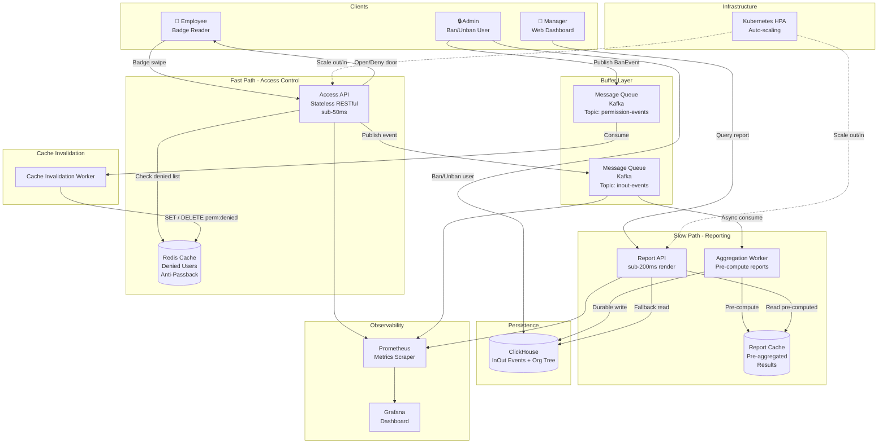

-----

## 4. Component Breakdown

### 4.1 Access Control Path (Fast Path)

The Fast Path handles the physical door open/deny decision. Latency target: **< 50ms end-to-end**.

#### 4.1.1 Access API

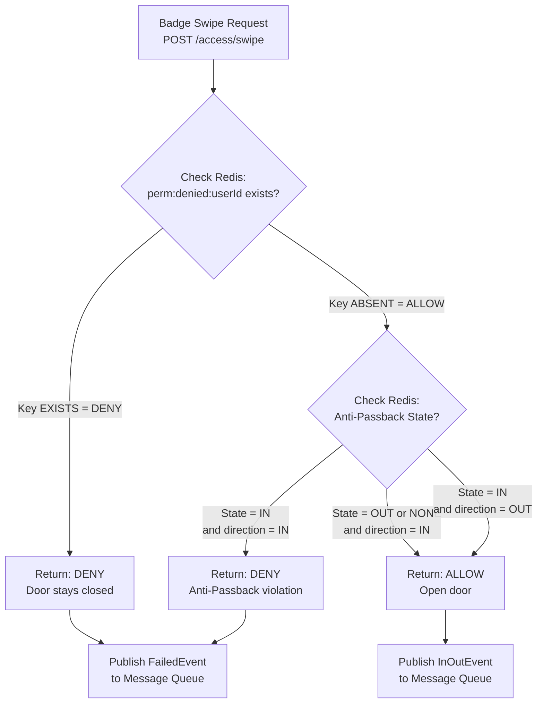

**Key design decisions:**

- The API is **stateless** — all state lives in Redis, enabling horizontal scaling
- **Only denied users are cached** — absence of a key means ALLOW; DB is never on the hot path for normal employees
- **Anti-passback** is enforced via a Redis key per user: `passback:{userId}` = `IN` | `OUT`
- All events (success and failure) are published to the queue for durability and analytics

#### 4.1.2 Redis Cache Schema

|Key Pattern           |Value               |TTL                 |Purpose                            |
|----------------------|--------------------|--------------------|-----------------------------------|
|`perm:denied:{userId}`|`DENY`              |24h                 |Denied user cache (absence = ALLOW)|
|`passback:{userId}`   |`IN` / `OUT`        |24h (reset midnight)|Anti-passback state                |
|`door:status:{doorId}`|`ONLINE` / `OFFLINE`|30s heartbeat       |Door health                        |

**Permission cache design:** Only **denied** users are stored in cache. If a key is absent, the user is considered allowed. This simplifies the default case — most employees have access — and means a cache miss no longer requires a DB lookup for normal employees.

#### 4.1.3 Cache Invalidation

Storing only denied users introduces a **cache inconsistency window**: if a user is banned in the DB but their `DENY` key has not yet been written to Redis, they will still be allowed entry. To address this, ban events are propagated via a dedicated Kafka topic consumed by a Cache Invalidation Worker:

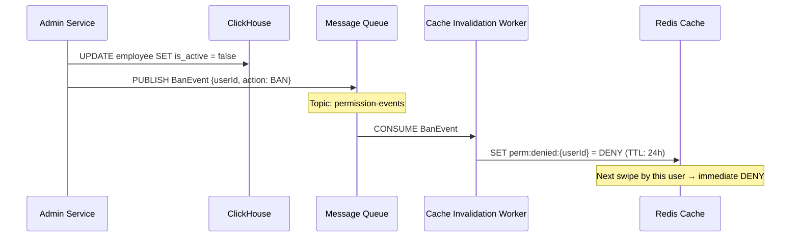

**Key properties:**

- Ban takes effect on the **next swipe** after the worker processes the event — typically within seconds
- `permission-events` is a separate Kafka topic from `inout-events`, so ban propagation is never delayed by swipe traffic
- On **unban**, the worker deletes the `perm:denied:{userId}` key — user is immediately allowed again

#### 4.1.4 Message Queue (Buffer Layer)

The queue is the critical component that enables **resilience** and **peak-load handling**:

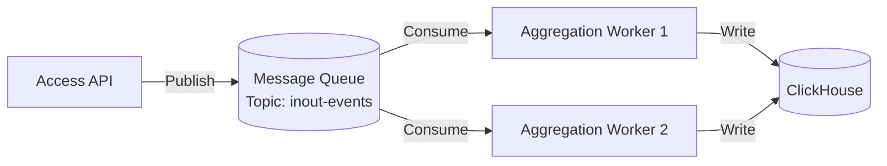

- **When DB is down:** Events accumulate in the queue. The door still opens (access decision was already made from cache). Once DB recovers, workers drain the queue and persist all events.
- **During peak hours (shift change):** The queue absorbs traffic spikes. Workers consume at a steady rate, preventing DB connection pool exhaustion.

-----

### 4.2 Reporting Path (Slow Path)

The Slow Path serves manager dashboards and attendance reports. Latency target: **< 200ms render time**.

#### 4.2.1 Aggregation Worker

The worker consumes events from the queue and does two things:

1. **Durable write** — persists the raw `InOutEvent` to ClickHouse
1. **Pre-aggregation** — incrementally updates materialized report caches

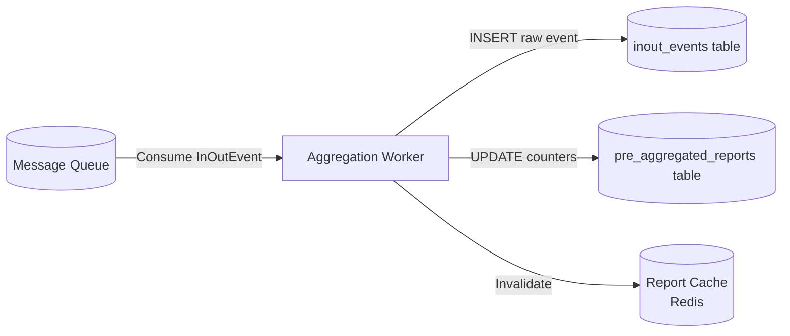


#### 4.2.2 Hierarchical Report Access (Permission Control)

Managers automatically see data for their team and all sub-teams. This is enforced via the **Organizational Tree** stored in the DB:

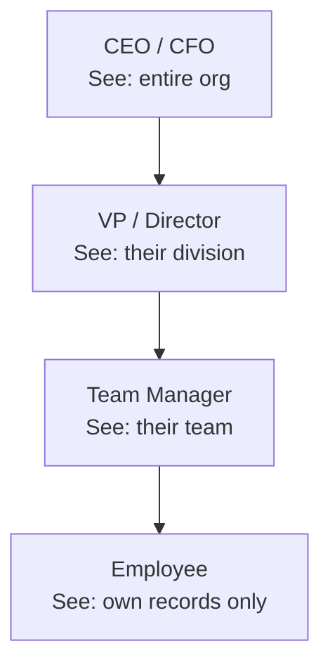

When a report is requested, the Report API resolves the requesting user’s position in the org tree and filters data to their subtree.

-----

## 5. Data Model

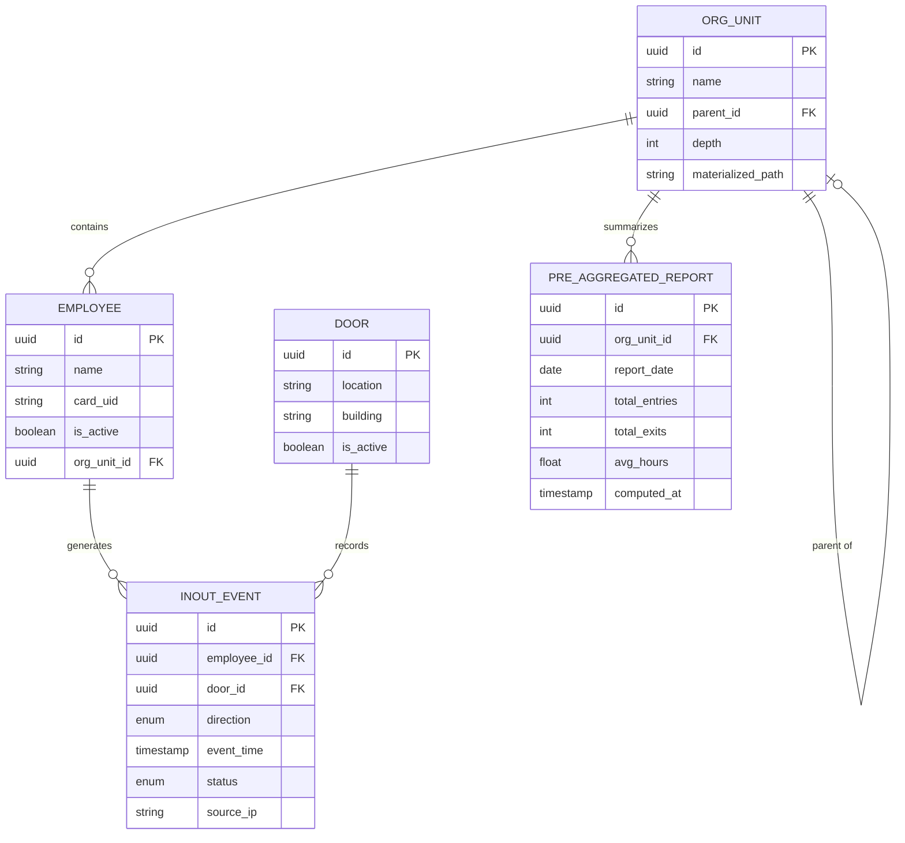

**Notes on `ORG_UNIT`:**

- `materialized_path` stores the full ancestry path (e.g., `/root/div-a/team-3/`) enabling fast subtree queries without recursive joins
- `depth` field enables level-based queries (e.g., “show all teams under this VP”)

-----

## 6. Sequence Diagrams

### 6.1 Normal Badge-In Flow

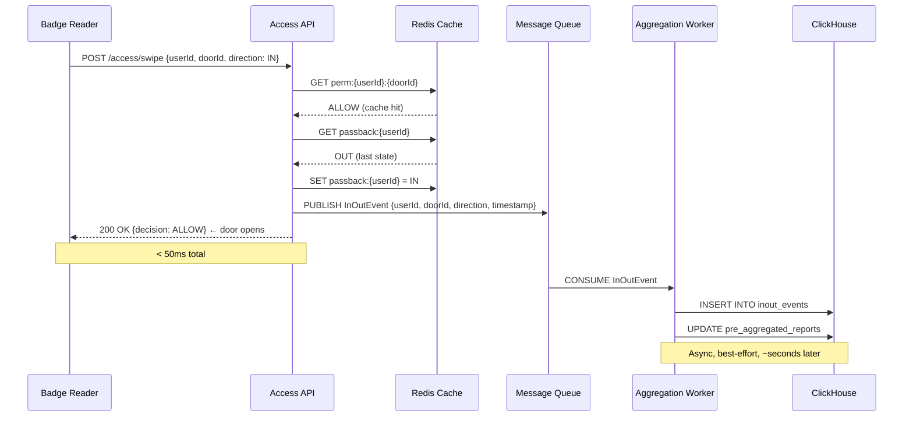

### 6.2 DB Down / Resilience Flow

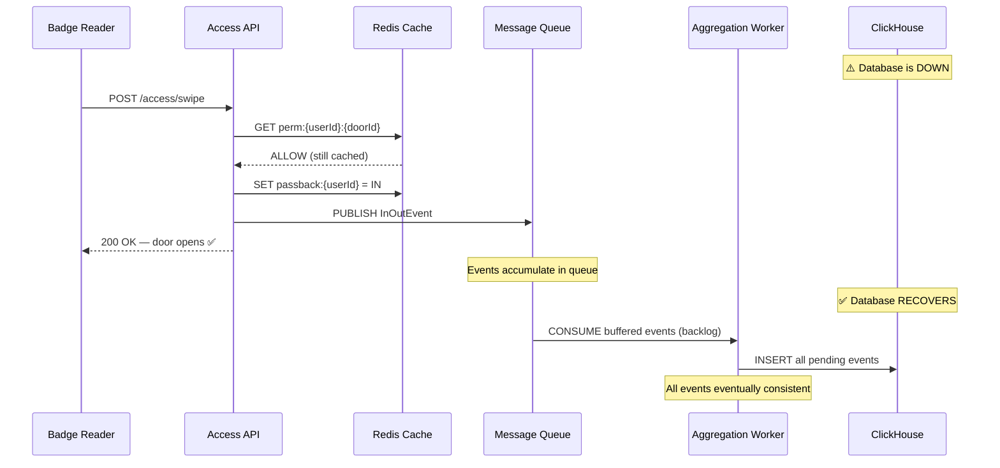

### 6.3 Manager Report Query Flow

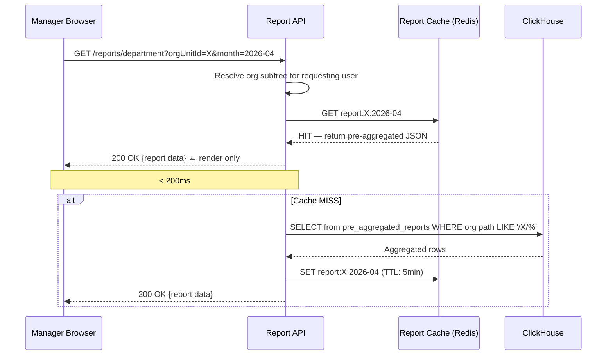

-----

## 7. API Design

### Access API Endpoints

|Method|Path                             |Description                           |Latency Target|
|------|---------------------------------|--------------------------------------|--------------|
|`POST`|`/access/swipe`                  |Process badge swipe, return ALLOW/DENY|< 50ms        |
|`GET` |`/access/door/{doorId}/status`   |Get door online/offline status        |< 100ms       |
|`GET` |`/access/employee/{userId}/state`|Get current IN/OUT state              |< 100ms       |

**POST /access/swipe — Request:**

```json
{
  "userId": "uuid",
  "doorId": "uuid",
  "direction": "IN | OUT",
  "cardUid": "string",
  "timestamp": "ISO8601"
}
```

**POST /access/swipe — Response:**

```json
{
  "decision": "ALLOW | DENY",
  "reason": "ANTI_PASSBACK | PERMISSION_DENIED | CARD_NOT_FOUND | null",
  "eventId": "uuid"
}
```

-----

### Report API Endpoints

|Method|Path                 |Description                      |Latency Target|
|------|---------------------|---------------------------------|--------------|
|`GET` |`/reports/personal`  |Employee’s own monthly attendance|< 200ms       |
|`GET` |`/reports/department`|Manager’s team/org-unit report   |< 200ms       |
|`GET` |`/reports/audit`     |Full raw event log (auditors)    |< 500ms       |
|`GET` |`/reports/export`    |Download PDF / CSV               |async         |

**GET /reports/department — Query Params:**

|Param        |Type  |Required|Description                                           |
|-------------|------|--------|------------------------------------------------------|
|`orgUnitId`  |uuid  |yes     |Target org unit (auto-filtered to requester’s subtree)|
|`startDate`  |date  |yes     |Report start date                                     |
|`endDate`    |date  |yes     |Report end date                                       |
|`granularity`|`daily|weekly  |monthly`                                              |

-----

## 8. Non-Functional Requirements Implementation

### Elastic Scalability (HPA)

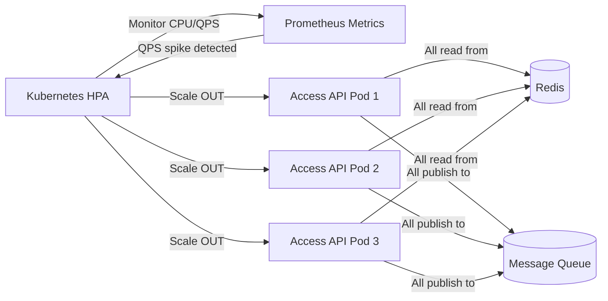

Because the Access API is **stateless** (all state is in Redis), scaling out is safe — any pod can handle any request.

-----

### Resilience

|Failure Scenario    |Behavior                                                        |Recovery                         |
|--------------------|----------------------------------------------------------------|---------------------------------|
|DB down             |Queue buffers events; doors still open from Redis cache         |DB recovers → workers drain queue|
|Redis down          |Access API falls back to DB permission check (slower path)      |Redis restarts → cache warms up  |
|Message Queue down  |Access API returns event ID and logs locally; retry on reconnect|Queue recovers → events replayed |
|Access API pod crash|Kubernetes restarts pod; HPA spins up replacement               |< 30s recovery                   |

-----

### Observability (Grafana Dashboard)

Key metrics to monitor, especially during **Shift Change** (peak period):

|Metric                     |Description                             |Alert Threshold|
|---------------------------|----------------------------------------|---------------|
|`access_api_qps`           |Requests per second on Access API       |> 1000 rps     |
|`access_api_p99_latency_ms`|99th percentile door decision latency   |> 50ms         |
|`queue_consumer_lag`       |Events in queue not yet written to DB   |> 10,000       |
|`redis_cache_hit_rate`     |% of permission checks served from cache|< 90%          |
|`db_connection_pool_usage` |Active DB connections                   |> 80%          |
|`report_api_p99_latency_ms`|99th percentile report render time      |> 200ms        |

-----

## 9. Infrastructure & Deployment

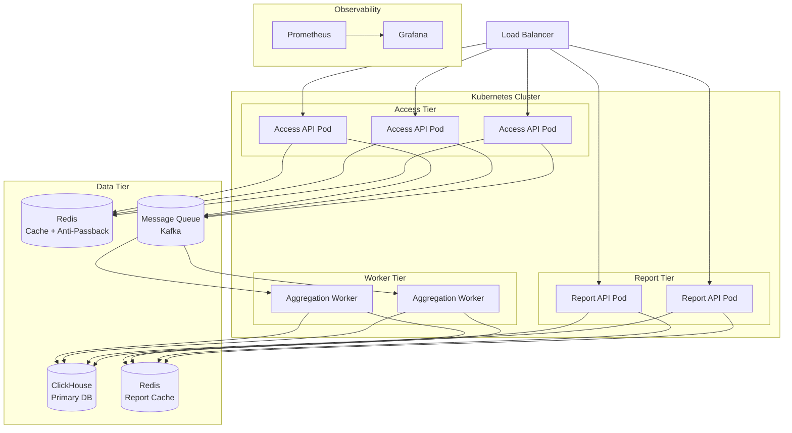

**Key infrastructure notes:**

- Access API, Report API, and Aggregation Workers are independently scalable deployments
- Redis is used for two separate concerns (permission/passback cache AND report cache) — can be the same cluster with separate key namespaces
- Message Queue (Kafka recommended) provides durability via log-based storage, ensuring no events are lost even during consumer downtime
- ClickHouse can be sharded by `org_unit_id` or by time range for large-scale deployments, as noted in meeting notes

-----

*Document generated for TSMC Cloud Native 2026 — Group 9*

